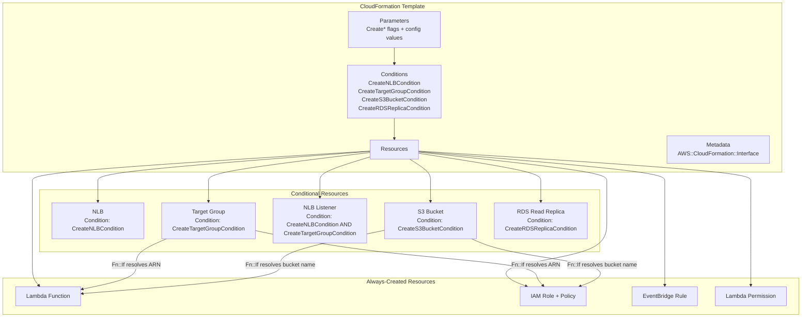
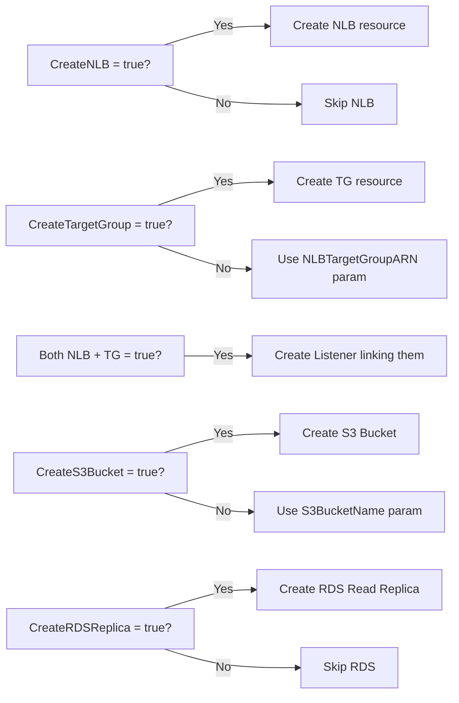

# Design Document: Conditional CloudFormation Resources

## Overview

This design restructures the existing CloudFormation template to support conditional resource creation using native CloudFormation Conditions and `Fn::If` intrinsic functions. The template moves from a "bring your own resources" model (where NLB, Target Group, S3 Bucket, and RDS replicas must pre-exist) to a hybrid model where each resource can optionally be created by the stack or referenced from pre-existing infrastructure.

The template relocates from the project root to `infrastructure/cloudformation_NLB_TG_with_RDS_RR.json` and the `example-parameters.json` file is removed. The template becomes self-documenting through `AWS::CloudFormation::Interface` metadata and descriptive parameter fields, with the AWS Console as the primary deployment interface.

### Design Decisions

1. **Boolean-as-String pattern**: CloudFormation does not support native boolean parameters. We use `String` type with `AllowedValues: ["true", "false"]` and compare with `Fn::Equals` to create conditions. This is the standard AWS pattern.

2. **Fn::If for dynamic references**: Rather than duplicating resources or using nested stacks, we use `Fn::If` to select between created-resource attributes and user-provided parameter values at a single reference point. This keeps the template flat and readable.

3. **No parameter file**: The template is designed for one-time or infrequent deployment. The `AWS::CloudFormation::Interface` metadata provides guided parameter entry in the Console. CLI users pass `--parameters` inline.

4. **Single read replica**: The RDS conditional creates exactly one read replica. Multiple replicas require multiple stack deployments or manual creation — this matches the "optionally create one" use case.

## Architecture



### Condition Evaluation Flow



## Components and Interfaces

### Parameters (New)

| Parameter | Type | Default | Description |
|-----------|------|---------|-------------|
| `CreateNLB` | String | `false` | Flag to create NLB. AllowedValues: `true`, `false` |
| `CreateTargetGroup` | String | `false` | Flag to create Target Group. AllowedValues: `true`, `false` |
| `CreateS3Bucket` | String | `false` | Flag to create S3 bucket. AllowedValues: `true`, `false` |
| `CreateRDSReplica` | String | `false` | Flag to create RDS read replica. AllowedValues: `true`, `false` |
| `NLBSubnetIds` | CommaDelimitedList | - | Subnet IDs for NLB (required when CreateNLB=true) |
| `VpcId` | `AWS::EC2::VPC::Id` | - | VPC ID for NLB/TG (required when CreateNLB=true or CreateTargetGroup=true) |
| `NLBScheme` | String | `internal` | NLB scheme. AllowedValues: `internet-facing`, `internal` |
| `SourceDBInstanceIdentifier` | String | - | Primary RDS instance ID to replicate from (required when CreateRDSReplica=true) |
| `DBInstanceClass` | String | `db.r5.large` | Instance class for read replica |

### Parameters (Existing — retained)

| Parameter | Type | Default |
|-----------|------|---------|
| `CodeS3Bucket` | String | - |
| `CodeS3Key` | String | `lambda-code/populate_NLB_TG_with_RDS_RR.zip` |
| `RDSReplicaDNSNames` | String | - |
| `NLBTargetGroupARN` | String | - |
| `S3BucketName` | String | - |
| `RDSListenerPort` | Number | `3306` |
| `StatePrefix` | String | `rds-cluster-read-replicas` |
| `MAXDNSLookupPerInvocation` | Number | `5` |
| `InvocationBeforeDeregistration` | Number | `3` |
| `MaxDeregistrationPercent` | Number | `50` |
| `Environment` | String | `production` |
| `Owner` | String | `platform-team` |
| `Region` | String | `us-west-2` |

### Conditions

| Condition | Expression |
|-----------|-----------|
| `CreateNLBCondition` | `Fn::Equals: [!Ref CreateNLB, "true"]` |
| `CreateTargetGroupCondition` | `Fn::Equals: [!Ref CreateTargetGroup, "true"]` |
| `CreateS3BucketCondition` | `Fn::Equals: [!Ref CreateS3Bucket, "true"]` |
| `CreateRDSReplicaCondition` | `Fn::Equals: [!Ref CreateRDSReplica, "true"]` |
| `CreateNLBAndTargetGroupCondition` | `Fn::And: [CreateNLBCondition, CreateTargetGroupCondition]` |

### Conditional Resources

#### NLB (`AWS::ElasticLoadBalancingV2::LoadBalancer`)
- **Condition**: `CreateNLBCondition`
- **Properties**: Type `network`, Scheme from `NLBScheme` param, Subnets from `NLBSubnetIds` param
- **Tags**: Application, Environment, Owner

#### Target Group (`AWS::ElasticLoadBalancingV2::TargetGroup`)
- **Condition**: `CreateTargetGroupCondition`
- **Properties**: TargetType `ip`, Protocol `TCP`, Port from `RDSListenerPort`, VpcId from `VpcId` param
- **HealthCheck**: Protocol `TCP`, Port from `RDSListenerPort`
- **Tags**: Application, Environment, Owner

#### NLB Listener (`AWS::ElasticLoadBalancingV2::Listener`)
- **Condition**: `CreateNLBAndTargetGroupCondition`
- **Properties**: LoadBalancerArn from created NLB, Port from `RDSListenerPort`, Protocol `TCP`, DefaultActions forward to created Target Group

#### S3 Bucket (`AWS::S3::Bucket`)
- **Condition**: `CreateS3BucketCondition`
- **Properties**:
  - `PublicAccessBlockConfiguration`: All four settings `true`
  - `BucketEncryption`: SSE-S3 (AES256)
  - `VersioningConfiguration`: Enabled
- **Tags**: Application, Environment, Owner

#### RDS Read Replica (`AWS::RDS::DBInstance`)
- **Condition**: `CreateRDSReplicaCondition`
- **Properties**: `SourceDBInstanceIdentifier` from param, `DBInstanceClass` from param
- **Tags**: Application, Environment, Owner

### Fn::If Resolution Pattern

The Lambda environment variables and IAM policy resource ARNs use `Fn::If` to dynamically resolve references:

```json
{
  "NLB_TG_ARN": {
    "Fn::If": [
      "CreateTargetGroupCondition",
      { "Ref": "NLBTargetGroup" },
      { "Ref": "NLBTargetGroupARN" }
    ]
  },
  "S3_BUCKET": {
    "Fn::If": [
      "CreateS3BucketCondition",
      { "Ref": "StateBucket" },
      { "Ref": "S3BucketName" }
    ]
  }
}
```

The same pattern applies to IAM policy resource ARNs:

```json
{
  "Resource": {
    "Fn::If": [
      "CreateTargetGroupCondition",
      { "Ref": "NLBTargetGroup" },
      { "Ref": "NLBTargetGroupARN" }
    ]
  }
}
```

```json
{
  "Resource": [
    {
      "Fn::If": [
        "CreateS3BucketCondition",
        { "Fn::Sub": ["arn:aws:s3:::${Bucket}", { "Bucket": { "Ref": "StateBucket" } }] },
        { "Fn::Sub": "arn:aws:s3:::${S3BucketName}" }
      ]
    },
    {
      "Fn::If": [
        "CreateS3BucketCondition",
        { "Fn::Sub": ["arn:aws:s3:::${Bucket}/*", { "Bucket": { "Ref": "StateBucket" } }] },
        { "Fn::Sub": "arn:aws:s3:::${S3BucketName}/*" }
      ]
    }
  ]
}
```

### AWS::CloudFormation::Interface Metadata

Groups parameters into logical sections for the Console form:

1. **Conditional Resource Flags** — `CreateNLB`, `CreateTargetGroup`, `CreateS3Bucket`, `CreateRDSReplica`
2. **NLB Configuration** — `NLBSubnetIds`, `VpcId`, `NLBScheme` (label: "Required when CreateNLB = true")
3. **Target Group Configuration** — `NLBTargetGroupARN` (label: "Required when CreateTargetGroup = false")
4. **S3 Configuration** — `S3BucketName` (label: "Required when CreateS3Bucket = false")
5. **RDS Configuration** — `SourceDBInstanceIdentifier`, `DBInstanceClass`, `RDSReplicaDNSNames`, `RDSListenerPort`
6. **Lambda Configuration** — `CodeS3Bucket`, `CodeS3Key`, `StatePrefix`, `MAXDNSLookupPerInvocation`, `InvocationBeforeDeregistration`, `MaxDeregistrationPercent`
7. **Tagging** — `Environment`, `Owner`
8. **Region** — `Region`

## Data Models

### Template Structure (JSON)

```
{
  "Transform": "AWS::Serverless-2016-10-31",
  "AWSTemplateFormatVersion": "2010-09-09",
  "Description": "...",
  "Metadata": { "AWS::CloudFormation::Interface": { ... } },
  "Parameters": { ... },
  "Conditions": { ... },
  "Resources": { ... },
  "Outputs": { ... }
}
```

### Outputs (New)

| Output | Condition | Value |
|--------|-----------|-------|
| `NLBArn` | `CreateNLBCondition` | `Ref` of created NLB |
| `NLBDNSName` | `CreateNLBCondition` | `Fn::GetAtt: [NLB, DNSName]` |
| `TargetGroupArn` | `CreateTargetGroupCondition` | `Ref` of created Target Group |
| `StateBucketName` | `CreateS3BucketCondition` | `Ref` of created S3 Bucket |
| `RDSReplicaEndpoint` | `CreateRDSReplicaCondition` | `Fn::GetAtt: [RDSReadReplica, Endpoint.Address]` |
| `LambdaFunctionArn` | (always) | `Fn::GetAtt: [LambdaFunction, Arn]` |
| `EffectiveTargetGroupArn` | (always) | The resolved TG ARN (same `Fn::If` expression) |
| `EffectiveBucketName` | (always) | The resolved bucket name (same `Fn::If` expression) |

### File System Changes

| Action | Path |
|--------|------|
| Create (move) | `infrastructure/cloudformation_NLB_TG_with_RDS_RR.json` |
| Delete | `cloudformation_NLB_TG_with_RDS_RR.json` (root) |
| Delete | `example-parameters.json` |
| Update | `DEPLOYMENT-GUIDE.md` (path references) |

## Correctness Properties

*These are structural correctness invariants that can be verified by inspecting the CloudFormation template JSON. Since this feature is Infrastructure as Code (declarative configuration, not functions with inputs/outputs), traditional property-based testing with generated inputs does not apply. Instead, we formalize structural assertions that must hold true in the template at all times.*

### Property 1: Condition Coverage

For every conditional resource in the `Resources` section that has a `Condition` key, the referenced condition name SHALL exist in the `Conditions` section of the template.

**Validates: Requirements 2.3, 2.4, 3.2, 3.5, 4.2, 4.4, 5.2, 5.4**

### Property 2: Fn::If Reference Resolution

For every `Fn::If` expression in the template (in Resources, Outputs, or any nested property), the condition name used as the first element of the `Fn::If` array SHALL exist in the `Conditions` section.

**Validates: Requirements 3.6, 4.5, 6.4**

### Property 3: Create Flag Parameter Consistency

For every `Create*` parameter (`CreateNLB`, `CreateTargetGroup`, `CreateS3Bucket`, `CreateRDSReplica`), there SHALL exist a corresponding condition (`Create*Condition`) whose expression is `Fn::Equals: [Ref: Create*, "true"]`.

**Validates: Requirements 2.1, 2.2, 3.1, 3.2, 4.1, 4.2, 5.1, 5.2**

### Property 4: Conditional Output Consistency

For every Output that has a `Condition` key, the referenced condition SHALL exist in the `Conditions` section, and the Output's `Value` SHALL only reference resources that share the same condition (or are always-created resources).

**Validates: Requirements 5.7**

### Property 5: Lambda Environment Variable Resolution

The Lambda function's environment variables `NLB_TG_ARN` and `S3_BUCKET` SHALL each use an `Fn::If` expression whose condition matches the corresponding resource's creation condition (`CreateTargetGroupCondition` and `CreateS3BucketCondition` respectively), with the "then" branch referencing the created resource and the "else" branch referencing the user-provided parameter.

**Validates: Requirements 3.6, 3.7, 4.5, 6.4**

### Property 6: IAM Policy Resource Alignment

The IAM policy resource ARNs for Target Group operations and S3 operations SHALL use the same `Fn::If` conditional resolution pattern as the corresponding Lambda environment variables, ensuring the IAM permissions always scope to whichever resource (created or pre-existing) the Lambda actually uses.

**Validates: Requirements 3.7, 4.6, 6.1, 6.3**

### Property 7: Interface Metadata Completeness

Every parameter defined in the `Parameters` section SHALL appear in at least one parameter group within the `AWS::CloudFormation::Interface` metadata section.

**Validates: Requirements 6.5, 7.2**

### Property 8: Conditional Resource Isolation

Resources with a `Condition` key SHALL NOT be referenced (via `Ref` or `Fn::GetAtt`) from an unconditional context unless wrapped in an `Fn::If` that gates on the same condition. This ensures CloudFormation never attempts to resolve attributes of uncreated resources.

**Validates: Requirements 2.4, 3.5, 4.4, 5.4, 6.4**

## Error Handling

### CloudFormation Validation Failures

| Scenario | Behavior |
|----------|----------|
| `CreateTargetGroup=false` and `NLBTargetGroupARN` empty | Stack creation fails at parameter validation — `NLBTargetGroupARN` has no default, Console shows it as required |
| `CreateS3Bucket=false` and `S3BucketName` empty | Stack creation fails — `S3BucketName` has no default, Console shows it as required |
| `CreateNLB=true` and `NLBSubnetIds` empty | Stack creation fails — NLB resource requires non-empty subnet list |
| `CreateRDSReplica=true` and `SourceDBInstanceIdentifier` empty | Stack creation fails — no default value on required param |
| `CreateNLB=true` and `VpcId` empty | Stack creation fails — `AWS::EC2::VPC::Id` type enforces valid VPC ID format |

### Runtime Resolution

- When a condition is `false`, CloudFormation does not evaluate the "then" branch of `Fn::If` — so references to uncreated resources in the unused branch do not cause errors.
- The `Fn::If` pattern ensures the Lambda always receives valid environment variable values regardless of which combination of Create flags is set.

### Deployment Guidance via Descriptions

Each parameter's `Description` field documents when it is required:
- `NLBTargetGroupARN`: "Required when CreateTargetGroup is false. ARN of your existing NLB Target Group."
- `S3BucketName`: "Required when CreateS3Bucket is false. Name of your existing S3 bucket for Lambda state."
- `NLBSubnetIds`: "Required when CreateNLB is true. Comma-separated subnet IDs for the NLB."
- `VpcId`: "Required when CreateNLB or CreateTargetGroup is true. VPC ID for networking resources."

## Testing Strategy

### Why Property-Based Testing Does Not Apply

This feature is **Infrastructure as Code (CloudFormation)** — a declarative JSON template. There are no functions with inputs/outputs, no algorithms, and no data transformations to test with generated inputs. The template is configuration, not logic. Testing is best served by:

1. **Template validation** — `aws cloudformation validate-template`
2. **Structural assertions** — Verify the JSON structure contains expected keys, conditions, and parameter definitions
3. **Scenario-based deployment tests** — Deploy with specific parameter combinations and verify resource creation

### Test Approach

#### 1. Static Template Validation
- Parse the JSON template and verify it is valid JSON
- Run `aws cloudformation validate-template` against the template
- Verify all required top-level keys exist (`Parameters`, `Conditions`, `Resources`, `Metadata`)

#### 2. Structural Unit Tests (pytest)
Load the template JSON and assert:
- All 4 `Create*` parameters exist with correct `AllowedValues`
- All 4 conditions exist with correct `Fn::Equals` expressions
- Conditional resources have the correct `Condition` key
- `Fn::If` expressions in Lambda env vars reference correct conditions
- `Fn::If` expressions in IAM policy reference correct conditions
- `AWS::CloudFormation::Interface` metadata groups all parameters
- NLB Listener has combined condition (`CreateNLBAndTargetGroupCondition`)
- S3 Bucket has Block Public Access, encryption, and versioning configured
- RDS replica has `SourceDBInstanceIdentifier` property
- `RDSReplicaEndpoint` output has correct condition

#### 3. Scenario Integration Tests
Deploy (or dry-run with `--no-execute-changeset`) with parameter combinations:
- All `Create*` flags `false` (baseline — only Lambda, IAM, EventBridge created)
- `CreateNLB=true`, `CreateTargetGroup=true` (NLB + TG + Listener created)
- `CreateS3Bucket=true` (S3 bucket created with security settings)
- `CreateRDSReplica=true` with valid source instance
- Mixed combinations to verify no cross-resource failures

#### 4. File System Verification
- Confirm `infrastructure/cloudformation_NLB_TG_with_RDS_RR.json` exists
- Confirm root-level `cloudformation_NLB_TG_with_RDS_RR.json` is removed
- Confirm `example-parameters.json` is removed
- Confirm `DEPLOYMENT-GUIDE.md` references updated paths
