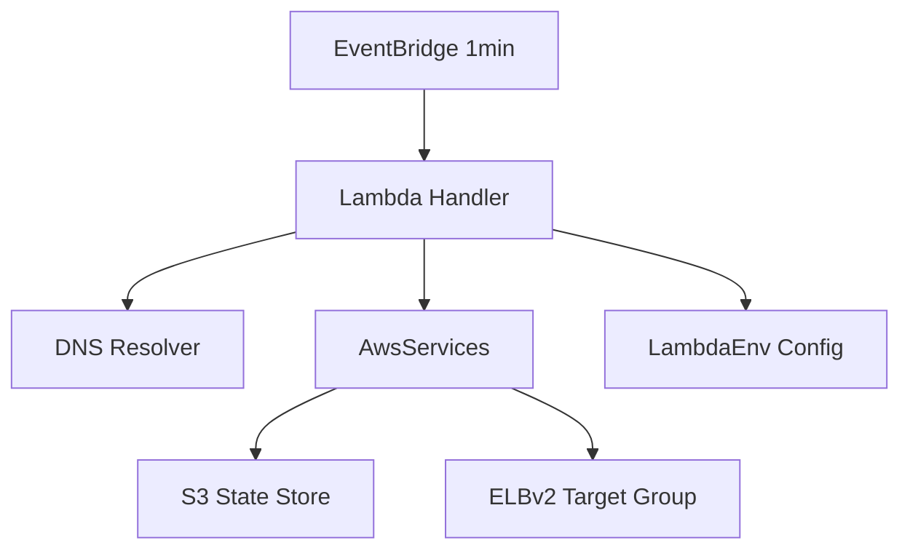

# Design Document: Code Quality Improvements

## Overview

This design addresses 15 requirements spanning code quality, resilience, and security improvements for the RDS Read Replica NLB Target Group Lambda function. The changes are structured to maintain backward compatibility while improving testability, safety, and maintainability.

The design preserves the existing module separation (handler → common → aws_services → constant) and introduces changes incrementally so that each module can be refactored and tested independently.

## Architecture

The existing architecture remains unchanged at the high level:



Key architectural changes:
1. **LambdaEnv** moves from class-level attributes to lazy property access
2. **AwsServices** gains explicit retry configuration and strict exception propagation
3. **Lambda Handler** gains a circuit breaker check before deregistration
4. **CloudFormation Template** gains concurrency limits, DLQ, tags, and parameterized naming
5. **Logging** moves to structured JSON format compatible with Lambda runtime

## Components and Interfaces

### 1. `constant.py` — LambdaEnv (Lazy Initialization)

**Current:** Class attributes evaluated at import time.

**Proposed:** Convert to a class with `@property` descriptors backed by a cached initialization method. The class is instantiated once per module but reads environment variables on first property access.

```python
import os
from datetime import datetime, timezone
from typing import List, Optional


class _LambdaEnvMeta:
    """Lazy environment configuration. Reads env vars on first access."""

    def __init__(self) -> None:
        self._initialized: bool = False
        self._cache: dict = {}

    def _ensure_initialized(self) -> None:
        if self._initialized:
            return
        self._cache["RDS_REPLICA_DNS_NAMES"] = os.environ["RDS_REPLICA_DNS_NAMES"]
        self._cache["RDS_LISTENER_PORT"] = int(os.environ["RDS_LISTENER_PORT"])
        self._cache["STATE_PREFIX"] = os.environ["STATE_PREFIX"]
        self._cache["CLOUDWATCH_LOG_GROUP"] = os.getenv("CLOUDWATCH_LOG_GROUP")
        self._cache["S3_BUCKET"] = os.environ["S3_BUCKET"]
        self._cache["NLB_TG_ARN"] = os.environ["NLB_TG_ARN"]
        self._cache["MAX_LOOKUP_PER_INVOCATION"] = int(os.environ["MAX_LOOKUP_PER_INVOCATION"])
        self._cache["INVOCATIONS_BEFORE_DEREGISTRATION"] = int(os.environ["INVOCATIONS_BEFORE_DEREGISTRATION"])
        self._cache["MAX_DEREGISTRATION_PERCENT"] = int(os.getenv("MAX_DEREGISTRATION_PERCENT", "50"))
        self._cache["SAME_VPC"] = os.getenv("SAME_VPC", "true").lower() == "true"
        self._cache["REGION"] = os.environ["AWS_REGION"]

        # Derived values
        dns_names = self._cache["RDS_REPLICA_DNS_NAMES"]
        dns_list = [name.strip() for name in dns_names.split(",") if name.strip()]
        if not dns_list:
            raise ValueError("RDS_REPLICA_DNS_NAMES must contain at least one valid DNS name")
        self._cache["RDS_REPLICA_DNS_LIST"] = dns_list

        prefix = self._cache["STATE_PREFIX"]
        self._cache["ACTIVE_IP_LIST_KEY"] = f"{prefix}/active_ip.json"
        self._cache["PENDING_IP_LIST_KEY"] = f"{prefix}/pending_ip.json"

        self._initialized = True

    def reset(self) -> None:
        """Reset cached state. Used in tests to re-read environment variables."""
        self._initialized = False
        self._cache.clear()

    @property
    def TIME(self) -> str:
        """Always returns current UTC time (not cached)."""
        return datetime.now(timezone.utc).strftime("%Y-%m-%d %H:%M:%S")

    # Properties for each config value (example pattern):
    @property
    def RDS_LISTENER_PORT(self) -> int:
        self._ensure_initialized()
        return self._cache["RDS_LISTENER_PORT"]

    # ... (same pattern for all other attributes)


LambdaEnv = _LambdaEnvMeta()
```

**Key decisions:**
- `TIME` is a property that always computes fresh (never cached)
- `reset()` method enables test isolation
- `LambdaEnv` remains a module-level singleton so existing `LambdaEnv.X` access patterns work unchanged
- DNS name validation happens during initialization

### 2. `aws_services.py` — AwsServices (Exception Handling & Retries)

**Changes:**
- Remove `publish_elb_ip_count_metric` method and CloudWatch client
- Add explicit `botocore.config.Config` with adaptive retry mode
- Catch only `ClientError`/`BotoCoreError` (not bare `Exception`)
- `write_content_to_s3` re-raises after logging
- `download_elb_ip_from_s3` catches `json.JSONDecodeError` separately
- Add type hints to all methods

```python
from botocore.config import Config

RETRY_CONFIG = Config(
    retries={"max_attempts": 3, "mode": "adaptive"}
)

class AwsServices:
    def __init__(self, region: str, bucket: str) -> None:
        self.s3 = boto3.resource("s3", region_name=region, config=RETRY_CONFIG)
        self.s3_client = boto3.client("s3", region_name=region, config=RETRY_CONFIG)
        self.elbv2 = boto3.client("elbv2", region_name=region, config=RETRY_CONFIG)
        # No CloudWatch client — removed unused metric publishing
```

**Exception handling pattern:**
```python
def write_content_to_s3(self, content: str, object_key: str) -> None:
    try:
        s3_object = self.s3.Object(self.bucket, object_key)
        s3_object.put(Body=content)
    except (ClientError, BotoCoreError) as e:
        logger.error(f"Failed to write to s3://{self.bucket}/{object_key}: {e}")
        raise

def download_elb_ip_from_s3(self, object_key: str) -> dict:
    try:
        response = self.s3_client.get_object(Bucket=self.bucket, Key=object_key)
    except ClientError as e:
        if e.response["Error"]["Code"] == "NoSuchKey":
            logger.info(f"No state file at {object_key}. Expected on first invocation.")
            return {}
        raise
    try:
        return json.loads(response["Body"].read())
    except json.JSONDecodeError as e:
        logger.error(f"Corrupted state file at {object_key}: {e}")
        raise
```

### 3. `common.py` — Business Logic & DNS

**Changes:**
- Remove `defaultdict` import, use plain `dict`
- Fix `precondition` to log error message (not the boolean)
- Define `DNS_RECORD_TYPE_A = "A"` constant
- Add type hints to all functions
- Fix logging configuration for Lambda compatibility
- Port parameter in `get_elb_ip_target_from_ip_list` typed as `int`

**Logging fix:**
```python
import logging

logger = logging.getLogger(__name__)
logger.setLevel(logging.INFO)
```

This defers to Lambda's pre-configured root handler instead of fighting it.

### 4. `populate_NLB_TG_with_RDS_RR.py` — Handler & Circuit Breaker

**Changes:**
- Move module docstring before imports
- Remove unused `sys` import
- Add return type annotation to `lambda_handler`
- Fix missing space in error message concatenation
- Add circuit breaker logic before deregistration
- Let S3 write exceptions propagate (fail the invocation)
- Add structured logging summary at end of invocation

**Circuit breaker logic:**
```python
def should_skip_deregistration(
    pending_deregistration_count: int,
    registered_target_count: int,
    max_deregistration_percent: int,
) -> bool:
    """
    Safety check: skip deregistration if it would remove too many targets.
    Returns True if deregistration should be skipped.
    """
    if registered_target_count == 0:
        return False
    deregistration_percent = (pending_deregistration_count / registered_target_count) * 100
    return deregistration_percent > max_deregistration_percent
```

**Structured logging (end of invocation):**
```python
import json as json_module

def log_invocation_summary(
    request_id: str,
    dns_ip_count: int,
    registered_count: int,
    deregistered_count: int,
    skipped_deregistration: bool,
) -> None:
    summary = {
        "event": "invocation_summary",
        "request_id": request_id,
        "dns_resolved_ips": dns_ip_count,
        "registered": registered_count,
        "deregistered": deregistered_count,
        "deregistration_skipped": skipped_deregistration,
    }
    logger.info(json_module.dumps(summary))
```

### 5. CloudFormation Template Changes

**Additions:**
- `MAX_DEREGISTRATION_PERCENT` parameter (default 50)
- Parameterized function name: `{"Fn::Sub": "${AWS::StackName}-RDS-NLB-Registration"}`
- `ReservedConcurrentExecutions: 1`
- `Timeout: 60`
- DLQ (SQS queue) with `DeadLetterConfig`
- Resource tags on Lambda, IAM Role, EventBridge Rule

### 6. Test Infrastructure

**Changes:**
- Remove function-scoped imports (possible after lazy LambdaEnv)
- Add `test/test_aws_services.py` — mocked boto3 tests
- Add `test/test_handler.py` — integration tests for lambda_handler
- Add `test/test_dns.py` — DNS function tests
- Clean up `unittest_constant.py` to remove unused constants
- Use integer port values in all tests

## Data Models

### S3 State: `active_ip.json`
```json
{
  "LoadBalancerName": "rds-cluster-read-replicas",
  "TimeStamp": "2024-01-15 10:30:00",
  "IPList": ["10.0.1.5", "10.0.2.8"],
  "IPCount": 2
}
```

### S3 State: `pending_ip.json`
```json
{
  "10.0.3.12": 2,
  "10.0.4.7": 1
}
```
Keys are IP addresses, values are consecutive invocation counts where the IP was not found in DNS.

### ELBv2 Target Format
```json
{"Id": "10.0.1.5", "Port": 3306}
```
Port is always an integer. When `SAME_VPC` is False, adds `"AvailabilityZone": "all"`.

### LambdaEnv Configuration (unchanged interface)
| Attribute | Type | Source |
|-----------|------|--------|
| RDS_REPLICA_DNS_NAMES | str | env |
| RDS_LISTENER_PORT | int | env |
| RDS_REPLICA_DNS_LIST | List[str] | derived |
| STATE_PREFIX | str | env |
| S3_BUCKET | str | env |
| NLB_TG_ARN | str | env |
| MAX_LOOKUP_PER_INVOCATION | int | env |
| INVOCATIONS_BEFORE_DEREGISTRATION | int | env |
| MAX_DEREGISTRATION_PERCENT | int | env (default 50) |
| SAME_VPC | bool | env (default true) |
| REGION | str | env |
| TIME | str | computed per access |
| ACTIVE_IP_LIST_KEY | str | derived |
| PENDING_IP_LIST_KEY | str | derived |


## Correctness Properties

*A property is a characteristic or behavior that should hold true across all valid executions of a system — essentially, a formal statement about what the system should do. Properties serve as the bridge between human-readable specifications and machine-verifiable correctness guarantees.*

### Property 1: Lazy initialization reads environment variables after import

*For any* set of valid environment variables set after the `constant` module is imported, accessing LambdaEnv properties SHALL return the values from those environment variables (not raise KeyError or return stale values).

**Validates: Requirements 1.1, 1.3**

### Property 2: TIME returns fresh timestamp on each access

*For any* two accesses to `LambdaEnv.TIME` separated by at least 1 second, the second value SHALL be strictly greater than the first when compared as timestamp strings.

**Validates: Requirements 1.2**

### Property 3: LambdaEnv interface preserves attribute types

*For any* valid environment variable configuration, all LambdaEnv attributes SHALL be accessible and return values matching their documented types (str, int, bool, List[str] as appropriate).

**Validates: Requirements 1.4**

### Property 4: Non-boto3 exceptions propagate from AwsServices

*For any* AwsServices method and any exception type that is not `ClientError` or `BotoCoreError`, when the underlying boto3 client raises that exception, the AwsServices method SHALL allow it to propagate to the caller unchanged.

**Validates: Requirements 2.1, 2.5**

### Property 5: write_content_to_s3 re-raises on failure

*For any* `ClientError` or `BotoCoreError` raised during an S3 put operation, `write_content_to_s3` SHALL re-raise the same exception after logging.

**Validates: Requirements 2.6, 5.1**

### Property 6: Write operation ClientErrors are logged with context

*For any* `ClientError` raised during a write operation in AwsServices, the logged message SHALL contain the error code from the exception response and the operation context (bucket/key or target group ARN).

**Validates: Requirements 2.2**

### Property 7: Circuit breaker skips deregistration above threshold

*For any* combination of pending deregistration count and registered target count where `(pending / registered) * 100 > max_deregistration_percent`, the `should_skip_deregistration` function SHALL return True.

**Validates: Requirements 4.1**

### Property 8: Target dictionaries use integer port values

*For any* list of IP address strings and any integer port value, `get_elb_ip_target_from_ip_list` SHALL produce target dictionaries where the "Port" field is an integer (not a string).

**Validates: Requirements 6.1, 6.2**

### Property 9: DNS name parsing rejects invalid entries

*For any* comma-separated string where at least one entry is empty or whitespace-only after splitting and trimming, LambdaEnv initialization SHALL raise a `ValueError`.

**Validates: Requirements 7.1, 7.2**

### Property 10: Invocation summary log is valid structured JSON

*For any* call to `log_invocation_summary`, the emitted log message SHALL be valid JSON containing the keys: `event`, `request_id`, `dns_resolved_ips`, `registered`, `deregistered`, and `deregistration_skipped`.

**Validates: Requirements 13.1, 13.2, 13.3**

### Property 11: Precondition logs error message not boolean value

*For any* falsy pre-condition value and any error message string, when `precondition` is called, the logged error output SHALL contain the error message string and SHALL NOT contain the string representation of the boolean value as the primary diagnostic.

**Validates: Requirements 14.6**

## Error Handling

### Error Handling Strategy

| Component | Error Type | Behavior |
|-----------|-----------|----------|
| LambdaEnv | Missing env var | Raise `KeyError` on first access (fail fast) |
| LambdaEnv | Invalid DNS names | Raise `ValueError` with descriptive message |
| AwsServices | S3 NoSuchKey | Return `{}` (expected on first run) |
| AwsServices | S3 other ClientError | Log + re-raise |
| AwsServices | S3 JSONDecodeError | Log corruption + raise |
| AwsServices | ELB ClientError (register) | Log + return `False` |
| AwsServices | ELB ClientError (deregister) | Log + continue (best effort) |
| AwsServices | ELB ClientError (describe) | Log + return empty list |
| AwsServices | Any non-boto3 exception | Propagate unhandled |
| Handler | DNS returns no IPs | Early exit, return None |
| Handler | Circuit breaker triggered | Skip deregistration, log warning, continue to state write |
| Handler | S3 state write failure | Exception propagates, Lambda reports failure |
| DNS | Resolution timeout/failure | Retry up to MAX_LOOKUP_PER_INVOCATION, then return empty set |

### Failure Modes and Recovery

1. **Transient S3 failure**: boto3 adaptive retry handles it (3 attempts). If all fail, invocation fails and DLQ captures the event. Next invocation retries naturally.

2. **Partial DNS failure**: Circuit breaker prevents mass deregistration. Pending counters still increment but deregistration is blocked until the situation resolves.

3. **ELB API throttling**: Adaptive retry with backoff handles throttling. Registration failure means `is_registered` stays False, so active state isn't updated — next invocation will retry.

4. **Corrupted S3 state**: JSONDecodeError propagates, failing the invocation. Operator must manually fix or delete the state file. DLQ captures the failure for alerting.

## Testing Strategy

### Testing Framework

- **Unit tests**: `pytest` with `unittest.mock`
- **Property-based tests**: `hypothesis` library (Python's standard PBT library)
- **Minimum iterations**: 100 per property test

### Test Organization

```
test/
├── conftest.py                    # Shared fixtures, env var setup
├── test_common.py                 # Existing + new tests for common.py
├── test_constant.py               # LambdaEnv lazy init, validation, types
├── test_aws_services.py           # Mocked boto3 client tests
├── test_handler.py                # Lambda handler integration tests
├── test_dns.py                    # DNS resolution function tests
├── test_circuit_breaker.py        # Circuit breaker logic tests
└── test_properties.py             # Property-based tests (hypothesis)
```

### Unit Tests

Unit tests cover specific examples and edge cases:
- AwsServices: each method with success, ClientError, NoSuchKey, JSONDecodeError
- Handler: happy path, DNS returns empty, S3 first run, circuit breaker trigger
- DNS: successful resolution, timeout, retry exhaustion, empty results
- LambdaEnv: valid config, missing vars, invalid DNS names, type conversions

### Property-Based Tests

Each correctness property maps to a hypothesis test:

| Property | Test Strategy | Generator |
|----------|--------------|-----------|
| 1 (Lazy init) | Set random env vars after import, verify access | `st.text()` for env values |
| 2 (TIME freshness) | Access TIME, sleep, access again | N/A (time-based) |
| 3 (Interface types) | Generate valid env configs, check types | `st.integers()`, `st.text()` |
| 4 (Exception propagation) | Raise random exceptions from mock | Custom exception generator |
| 5 (Write re-raise) | Generate ClientErrors, verify re-raise | `st.text()` for error codes |
| 6 (Error logging) | Generate ClientErrors, check log content | `st.text()` for codes/keys |
| 7 (Circuit breaker) | Generate count pairs, verify threshold | `st.integers(min_value=0)` |
| 8 (Port type) | Generate IP lists and int ports | `st.lists(st.ip_addresses())`, `st.integers(1, 65535)` |
| 9 (DNS validation) | Generate strings with empty entries | `st.text()` with comma insertion |
| 10 (Structured log) | Generate summary inputs, parse output | `st.text()`, `st.integers()` |
| 11 (Precondition log) | Generate error messages, check log | `st.text(min_size=1)` |

### Test Configuration

```python
from hypothesis import given, settings, strategies as st

@settings(max_examples=100)
@given(...)
def test_property_N(...):
    # Feature: code-quality-improvements, Property N: <title>
    ...
```

### Dual Testing Approach

- **Unit tests** catch specific bugs: "NoSuchKey returns empty dict", "missing env var raises KeyError"
- **Property tests** verify universal invariants: "for ALL ClientErrors, write_content_to_s3 re-raises"
- Together they provide both concrete regression protection and broad correctness guarantees
