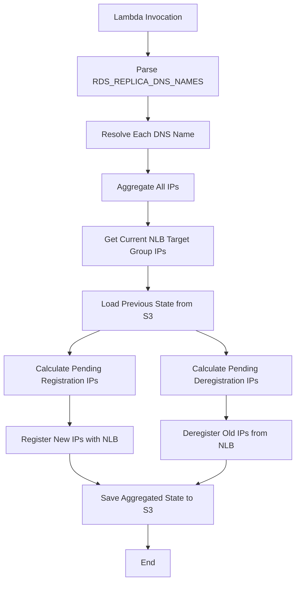
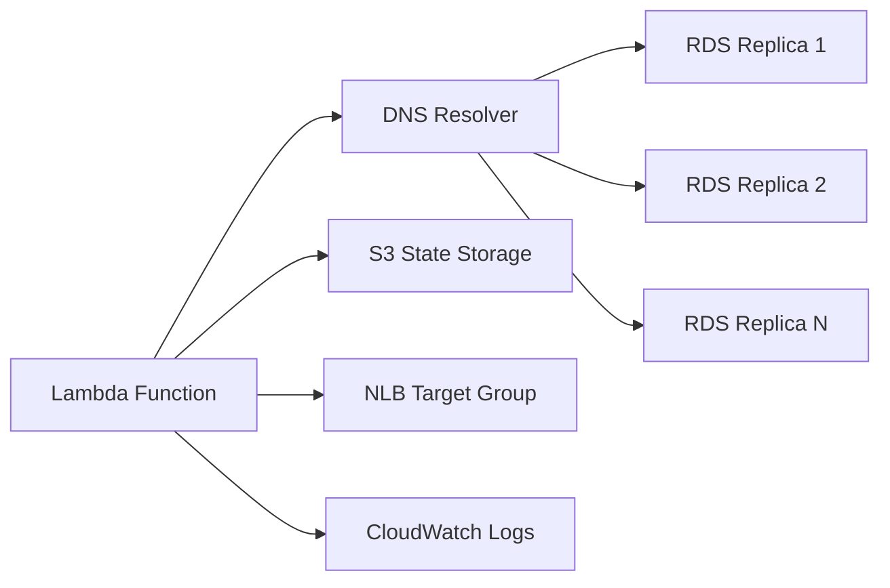

# Design Document: RDS Read Replica NLB Registration

## Overview

This design adapts the existing ALB-to-NLB IP registration Lambda function to support RDS read replicas. The key architectural change is supporting multiple DNS names (one per read replica) instead of a single ALB DNS name. The solution maintains the same core workflow: DNS resolution → IP aggregation → NLB target group registration → S3 state tracking → cautious deregistration.

The Lambda function will:
- Parse a comma-separated list of RDS read replica DNS names from environment variables
- Resolve each DNS name independently and aggregate all discovered IPs
- Register new IPs with the NLB target group immediately
- Track IPs no longer in DNS and deregister them after a configurable invocation threshold
- Store aggregated state in S3 for continuity between invocations

## Architecture

### High-Level Flow



### Component Interaction



## Components and Interfaces

### 1. Configuration Module (constant.py)

**Purpose:** Read and validate environment variables, compute derived values.

**New Environment Variables:**
- `RDS_REPLICA_DNS_NAMES`: Comma-separated list of RDS read replica DNS names
- `RDS_LISTENER_PORT`: Database listener port (typically 3306 for MySQL, 5432 for PostgreSQL)
- `CLOUDWATCH_LOG_GROUP`: CloudWatch Logs group name (optional, defaults to Lambda's log group)
- `STATE_PREFIX`: S3 key prefix for state files (replaces ALB_DNS_NAME usage)

**Retained Environment Variables:**
- `S3_BUCKET`: S3 bucket for state persistence
- `NLB_TG_ARN`: NLB target group ARN
- `MAX_LOOKUP_PER_INVOCATION`: DNS lookup retry limit per DNS name
- `INVOCATIONS_BEFORE_DEREGISTRATION`: Invocation threshold for deregistration
- `SAME_VPC`: Boolean flag for VPC configuration
- `AWS_REGION`: AWS region

**Removed Environment Variables:**
- `ALB_DNS_NAME`: No longer used (replaced by RDS_REPLICA_DNS_NAMES)
- `ALB_LISTENER`: No longer used (replaced by RDS_LISTENER_PORT)
- `CW_METRIC_FLAG_IP_COUNT`: Removed (CloudWatch metrics are optional)

**Interface:**
```python
class LambdaEnv:
    RDS_REPLICA_DNS_NAMES: str  # Raw comma-separated string
    RDS_REPLICA_DNS_LIST: List[str]  # Parsed and trimmed list
    RDS_LISTENER_PORT: int
    CLOUDWATCH_LOG_GROUP: Optional[str]
    STATE_PREFIX: str
    S3_BUCKET: str
    NLB_TG_ARN: str
    MAX_LOOKUP_PER_INVOCATION: int
    INVOCATIONS_BEFORE_DEREGISTRATION: int
    SAME_VPC: bool
    REGION: str
    ACTIVE_IP_LIST_KEY: str  # Computed: {STATE_PREFIX}/active_ip.json
    PENDING_IP_LIST_KEY: str  # Computed: {STATE_PREFIX}/pending_ip.json
    TIME: str  # ISO 8601 timestamp
```

**Validation Logic:**
- `RDS_REPLICA_DNS_NAMES` must not be empty
- `RDS_LISTENER_PORT` must be a positive integer
- `MAX_LOOKUP_PER_INVOCATION` must be a positive integer
- `INVOCATIONS_BEFORE_DEREGISTRATION` must be a positive integer
- Parse `RDS_REPLICA_DNS_NAMES` by splitting on commas and trimming whitespace

### 2. DNS Resolution Module (common.py)

**Purpose:** Resolve multiple RDS DNS names and aggregate IPs.

**New Function:**
```python
def get_rds_replica_ips_from_dns(
    dns_name_list: List[str],
    record_type: str,
    max_lookup_per_invocation: int
) -> Set[str]:
    """
    Resolve multiple RDS replica DNS names and aggregate all IPs.
    
    Args:
        dns_name_list: List of RDS replica DNS names
        record_type: DNS record type (typically "A")
        max_lookup_per_invocation: Max DNS lookup retries per name
    
    Returns:
        Set of all resolved IP addresses across all replicas
    """
```

**Implementation Strategy:**
- Iterate through each DNS name in the list
- For each DNS name, call existing `get_elb_ip_from_dns()` function
- If DNS resolution fails for a name, log the error and continue with remaining names
- Aggregate all resolved IPs into a single set
- Return the aggregated IP set

**Modified Function:**
```python
def get_elb_ip_from_dns(elb_dns_name, record_type, total_retry_count):
    # Remove the early termination logic for < 8 IPs
    # Always perform full retry count
```

**Retained Functions:**
- `dns_lookup()`: Low-level DNS query with name server support
- `dns_lookup_with_retry()`: DNS query with retry logic (modified to remove < 8 IP check)
- `get_elb_authoritative_name_server_ip_list()`: Get authoritative name servers
- `get_pending_registration_ip_set()`: Calculate IPs pending registration
- `get_invocation_count_per_pending_deregistration_ip()`: Track deregistration invocation counts
- `get_pending_deregistration_ip_set()`: Calculate IPs pending deregistration
- `get_elb_ip_target_from_ip_list()`: Format IPs as ELBv2 targets
- `precondition()`: Validation helper

### 3. AWS Services Module (aws_services.py)

**Purpose:** Encapsulate AWS API interactions.

**No Changes Required:** The existing `AwsServices` class already supports all required operations:
- S3 read/write for state persistence
- ELBv2 register/deregister targets
- ELBv2 describe target health
- CloudWatch metrics publishing (optional, not used in this implementation)

**Interface:**
```python
class AwsServices:
    def __init__(self, region: str, bucket: str)
    def write_content_to_s3(self, content: str, object_key: str)
    def download_elb_ip_from_s3(self, object_key: str) -> Dict
    def register_target(self, tg_arn: str, target_list: List[Dict]) -> bool
    def deregister_target(self, tg_arn: str, target_list: List[Dict])
    def get_ip_target_list_by_target_group_arn(self, tg_arn: str) -> List[str]
```

### 4. Main Handler Module (populate_NLB_TG_with_ALB.py)

**Purpose:** Orchestrate the 7-step workflow.

**Modified Workflow:**

**Step 1: Get IPs from DNS**
- Parse `RDS_REPLICA_DNS_LIST` from environment
- Call `get_rds_replica_ips_from_dns()` with the DNS name list
- Aggregate all resolved IPs into a single set
- Exit if no IPs are found

**Step 2: Get IPs from NLB Target Group**
- Call `get_ip_target_list_by_target_group_arn()` to get currently registered IPs
- No changes from existing implementation

**Step 3: Get Active and Pending IPs from S3**
- Download `{STATE_PREFIX}/active_ip.json`
- Download `{STATE_PREFIX}/pending_ip.json`
- No changes from existing implementation

**Step 4: Calculate Pending Registration IPs**
- Call `get_pending_registration_ip_set()` with aggregated DNS IPs and target group IPs
- No changes from existing implementation

**Step 5: Calculate Pending Deregistration IPs**
- Call `get_invocation_count_per_pending_deregistration_ip()` to track invocation counts
- Call `get_pending_deregistration_ip_set()` to get IPs ready for deregistration
- No changes from existing implementation

**Step 6: Update NLB Target Group**
- Register pending registration IPs
- Deregister pending deregistration IPs (if invocation threshold reached)
- No changes from existing implementation

**Step 7: Save State to S3**
- Save aggregated active IPs to `{STATE_PREFIX}/active_ip.json`
- Save pending deregistration IPs to `{STATE_PREFIX}/pending_ip.json`
- Use `STATE_PREFIX` as the identifier in metadata (instead of ALB_DNS_NAME)

## Data Models

### Active IP State (S3: {STATE_PREFIX}/active_ip.json)

```json
{
  "LoadBalancerName": "rds-cluster-read-replicas",
  "TimeStamp": "2024-01-15 10:30:00",
  "IPList": ["10.0.1.10", "10.0.2.20", "10.0.3.30"],
  "IPCount": 3
}
```

**Fields:**
- `LoadBalancerName`: Set to `STATE_PREFIX` value for identification
- `TimeStamp`: ISO 8601 timestamp of last update
- `IPList`: Array of all active IP addresses across all read replicas
- `IPCount`: Total count of active IPs

### Pending Deregistration IP State (S3: {STATE_PREFIX}/pending_ip.json)

```json
{
  "10.0.1.50": 1,
  "10.0.2.60": 3
}
```

**Format:** Dictionary mapping IP addresses to invocation counts
- Key: IP address (string)
- Value: Number of consecutive invocations where this IP was absent from DNS (integer)

### ELBv2 Target Format

```python
# When SAME_VPC is True
{"Id": "10.0.1.10", "Port": 3306}

# When SAME_VPC is False
{"Id": "10.0.1.10", "Port": 3306, "AvailabilityZone": "all"}
```

## Correctness Properties


*A property is a characteristic or behavior that should hold true across all valid executions of a system—essentially, a formal statement about what the system should do. Properties serve as the bridge between human-readable specifications and machine-verifiable correctness guarantees.*

### Property 1: DNS Name List Parsing

*For any* comma-separated string of DNS names (with or without whitespace), parsing the string should produce a list where each DNS name is trimmed of leading/trailing whitespace and empty strings are excluded.

**Validates: Requirements 1.1, 2.2, 2.3**

### Property 2: Independent DNS Resolution

*For any* list of DNS names where some may fail to resolve, the function should attempt to resolve all names independently, and a failure to resolve one name should not prevent resolution of other names.

**Validates: Requirements 1.2, 1.4**

### Property 3: IP Aggregation from Multiple Sources

*For any* set of DNS resolution results from multiple DNS names, all resolved IPs should be aggregated into a single set with no duplicates.

**Validates: Requirements 1.3, 3.1**

### Property 4: New IP Registration

*For any* IP address that appears in DNS results but is not currently registered in the NLB target group, that IP should be added to the pending registration set.

**Validates: Requirements 4.1**

### Property 5: Pending Deregistration Invocation Counting

*For any* IP address that is absent from DNS results, if it was previously active or currently registered, its invocation count should be incremented by 1 (or initialized to 1 if first occurrence).

**Validates: Requirements 4.2, 4.3**

### Property 6: Deregistration Threshold

*For any* pending deregistration IP with invocation count greater than or equal to INVOCATIONS_BEFORE_DEREGISTRATION, that IP should be included in the deregistration set.

**Validates: Requirements 4.4**

### Property 7: Pending IP Recovery

*For any* IP address in the pending deregistration list, if that IP reappears in DNS results, it should be removed from the pending deregistration list.

**Validates: Requirements 4.5**

### Property 8: Dynamic DNS Name Addition

*For any* DNS name added to the RDS_REPLICA_DNS_NAMES list, that DNS name should be resolved on the next invocation and its IPs should be included in the aggregated IP set.

**Validates: Requirements 5.1**

### Property 9: Dynamic DNS Name Removal

*For any* DNS name removed from the RDS_REPLICA_DNS_NAMES list, IPs previously associated with that DNS name should enter the pending deregistration process if they no longer appear in results from remaining DNS names.

**Validates: Requirements 5.2, 5.3**

### Property 10: State Persistence Across Configuration Changes

*For any* change to the RDS_REPLICA_DNS_NAMES list, the S3 state files should remain accessible and parseable, and existing pending deregistration counts should be preserved.

**Validates: Requirements 5.4**

### Property 11: DNS Retry Logic

*For any* DNS name, the resolution function should attempt up to MAX_LOOKUP_PER_INVOCATION lookups, and should try alternative name servers if one fails.

**Validates: Requirements 7.2, 7.3**

### Property 12: State Serialization Round-Trip

*For any* valid active IP state or pending IP state, serializing to JSON and then deserializing should produce an equivalent state object.

**Validates: Requirements 9.4**

### Property 13: Missing State File Handling

*For any* S3 state file that does not exist, reading the state should return an empty dictionary without raising an exception.

**Validates: Requirements 9.5**

### Property 14: Error Logging

*For any* error condition (DNS failure, NLB API failure, S3 failure, validation failure), the error details should be logged to CloudWatch Logs with sufficient context to diagnose the issue.

**Validates: Requirements 8.1, 8.2, 8.3, 8.4, 8.5**

## Error Handling

### DNS Resolution Errors

**Strategy:** Continue processing remaining DNS names when one fails.

**Implementation:**
- Wrap each DNS resolution in a try-except block
- Log the DNS name and exception details
- Continue with the next DNS name in the list
- If all DNS names fail, log a critical error and exit without modifying the NLB target group

**Example:**
```python
aggregated_ips = set()
for dns_name in dns_name_list:
    try:
        ips = resolve_dns(dns_name)
        aggregated_ips.update(ips)
    except Exception as e:
        logger.error(f"Failed to resolve {dns_name}: {e}")
        continue

if not aggregated_ips:
    logger.critical("No IPs resolved from any DNS name. Exiting.")
    sys.exit(1)
```

### NLB API Errors

**Strategy:** Log errors but continue execution to allow state updates.

**Implementation:**
- Wrap `register_target()` and `deregister_target()` calls in try-except blocks
- Log the target IPs, target group ARN, and exception details
- Return a boolean indicating success/failure for registration
- Only update S3 active IP state if registration succeeds
- Always update S3 pending IP state to track invocation counts

### S3 Errors

**Strategy:** Gracefully handle missing files; fail loudly on write errors.

**Read Errors:**
- Missing files are expected on first invocation
- Return empty dictionary for missing files
- Log warning for missing files
- Log error for other S3 read failures

**Write Errors:**
- Log error with bucket name, object key, and exception details
- Do not exit (allow Lambda to complete and retry on next invocation)

### Environment Variable Validation Errors

**Strategy:** Fail fast with clear error messages.

**Implementation:**
- Validate all required environment variables at startup
- Log the specific variable name that is missing or invalid
- Exit immediately with non-zero status code
- Do not make any changes to NLB target group or S3 state

## Testing Strategy

### Dual Testing Approach

This feature requires both unit tests and property-based tests for comprehensive coverage:

**Unit Tests:** Verify specific examples, edge cases, and error conditions
- Specific DNS name parsing examples (empty strings, whitespace variations)
- Integration points between modules
- Error handling paths (DNS failures, NLB API failures, S3 failures)
- Edge cases (empty DNS list, all DNS names fail, threshold boundary conditions)

**Property Tests:** Verify universal properties across all inputs
- DNS name parsing with random comma-separated strings
- IP aggregation with random IP sets
- Invocation counting with random state transitions
- State serialization round-trips with random state objects
- Comprehensive input coverage through randomization (minimum 100 iterations per property)

### Property-Based Testing Configuration

**Library:** Use `hypothesis` for Python property-based testing

**Configuration:**
- Minimum 100 iterations per property test
- Each property test must reference its design document property
- Tag format: **Feature: rds-read-replica-nlb-registration, Property {number}: {property_text}**

**Example Property Test:**
```python
from hypothesis import given, strategies as st

@given(
    dns_names=st.lists(st.text(min_size=1), min_size=1, max_size=10),
    ips_per_name=st.lists(st.sets(st.ip_addresses(v=4)), min_size=1, max_size=10)
)
def test_ip_aggregation_property(dns_names, ips_per_name):
    """
    Feature: rds-read-replica-nlb-registration
    Property 3: IP Aggregation from Multiple Sources
    
    For any set of DNS resolution results from multiple DNS names,
    all resolved IPs should be aggregated into a single set with no duplicates.
    """
    # Test implementation
    pass
```

### Test Coverage Requirements

**Core Logic:**
- DNS name parsing and validation
- DNS resolution with retry and failover
- IP set operations (pending registration, pending deregistration)
- Invocation counting logic
- State serialization/deserialization
- Target list formatting for ELBv2 API

**Integration Points:**
- Environment variable reading and validation
- S3 state persistence
- NLB target group operations
- CloudWatch Logs integration

**Error Paths:**
- Empty or missing environment variables
- DNS resolution failures
- NLB API failures
- S3 read/write failures
- Invalid JSON in S3 state files

### Testing Best Practices

**Unit Test Balance:**
- Focus unit tests on specific examples and edge cases
- Avoid writing too many unit tests for scenarios covered by property tests
- Property tests handle comprehensive input coverage through randomization

**Property Test Focus:**
- Universal properties that hold for all inputs
- Comprehensive input coverage through randomization
- Each correctness property should be implemented by a single property-based test

## Implementation Notes

### Code Reuse from ALB Solution

**Modules to Reuse (with modifications):**
- `aws_services.py`: No changes required
- `common.py`: Modify `dns_lookup_with_retry()` to remove < 8 IP check; add `get_rds_replica_ips_from_dns()`
- `populate_NLB_TG_with_ALB.py`: Modify Step 1 to use multiple DNS names; update metadata to use STATE_PREFIX

**Modules to Replace:**
- `constant.py`: Replace environment variable definitions to use RDS-specific variables

### Migration Path

For teams currently using the ALB solution who want to adopt the RDS solution:

1. Deploy the RDS Lambda function as a separate function (do not modify existing ALB function)
2. Configure RDS-specific environment variables
3. Use a different S3 bucket or STATE_PREFIX to avoid conflicts
4. Test with a non-production NLB target group first
5. Monitor CloudWatch Logs for DNS resolution and registration behavior
6. Gradually increase INVOCATIONS_BEFORE_DEREGISTRATION if needed for stability

### Performance Considerations

**DNS Resolution:**
- Each DNS name requires multiple DNS queries (authoritative name server lookup + IP resolution)
- With N replicas and M lookups per invocation, total DNS queries = N * (M + 2)
- Example: 3 replicas, 5 lookups = 3 * 7 = 21 DNS queries per invocation
- Lambda timeout should be set to at least 30 seconds for 5+ replicas

**S3 Operations:**
- 2 S3 reads per invocation (active IP, pending IP)
- 2 S3 writes per invocation (active IP, pending IP)
- S3 operations are fast (<100ms typically) and should not be a bottleneck

**NLB API Operations:**
- 1 describe_target_health call per invocation
- 1 register_targets call if new IPs found
- 1 deregister_targets call if threshold reached
- ELBv2 API calls are typically <500ms each

**Total Execution Time Estimate:**
- DNS resolution: 2-5 seconds (depends on replica count and network latency)
- S3 operations: <500ms
- NLB operations: <1 second
- Total: 3-7 seconds typical, 10-15 seconds worst case

### Security Considerations

**IAM Permissions Required:**
```json
{
  "Version": "2012-10-17",
  "Statement": [
    {
      "Effect": "Allow",
      "Action": [
        "elasticloadbalancing:RegisterTargets",
        "elasticloadbalancing:DeregisterTargets",
        "elasticloadbalancing:DescribeTargetHealth"
      ],
      "Resource": "arn:aws:elasticloadbalancing:*:*:targetgroup/*"
    },
    {
      "Effect": "Allow",
      "Action": [
        "s3:GetObject",
        "s3:PutObject"
      ],
      "Resource": "arn:aws:s3:::${S3_BUCKET}/${STATE_PREFIX}/*"
    },
    {
      "Effect": "Allow",
      "Action": [
        "logs:CreateLogGroup",
        "logs:CreateLogStream",
        "logs:PutLogEvents"
      ],
      "Resource": "arn:aws:logs:*:*:*"
    }
  ]
}
```

**Network Access:**
- Lambda function must have network access to:
  - RDS authoritative DNS servers (public internet or VPC DNS)
  - NLB target group (AWS API endpoints)
  - S3 bucket (AWS API endpoints)
  - CloudWatch Logs (AWS API endpoints)

**VPC Configuration:**
- If `SAME_VPC=true`, Lambda must be in the same VPC as the NLB and RDS instances
- If `SAME_VPC=false`, Lambda can be in any VPC or no VPC, but must specify AvailabilityZone="all" for targets

### Monitoring and Observability

**CloudWatch Logs:**
- All DNS resolution attempts and results
- All NLB registration/deregistration operations
- All S3 state read/write operations
- All error conditions with full context

**CloudWatch Metrics (Optional):**
- `RDSReplicaIPCount`: Total active IP count across all replicas
- Dimension: `StatePrefix` (identifies the RDS cluster)
- Namespace: `AWS/RDS` or custom namespace

**Recommended Alarms:**
- Lambda function errors (threshold: > 0)
- Lambda function duration (threshold: > 25 seconds)
- No IPs resolved from DNS (custom metric or log-based alarm)
- NLB target health (use existing ELBv2 metrics)

### Operational Runbook

**Scenario: All DNS names fail to resolve**
1. Check CloudWatch Logs for DNS error details
2. Verify RDS read replicas are running and healthy
3. Verify Lambda has network access to DNS servers
4. Manually resolve DNS names using `dig` or `nslookup` to confirm DNS is working
5. Check if RDS_REPLICA_DNS_NAMES environment variable is correct

**Scenario: IPs are registered but NLB health checks fail**
1. Check NLB target group health check configuration
2. Verify RDS_LISTENER_PORT matches the actual database port
3. Verify security groups allow traffic from NLB to RDS instances
4. Verify SAME_VPC setting matches actual network topology

**Scenario: Old IPs are not being deregistered**
1. Check INVOCATIONS_BEFORE_DEREGISTRATION setting (may be too high)
2. Check CloudWatch Logs for pending IP invocation counts
3. Verify S3 state files are being updated correctly
4. Check if old IPs are still appearing in DNS (may indicate DNS caching issue)

**Scenario: State files are corrupted or missing**
1. Check S3 bucket permissions
2. Manually inspect S3 state files for valid JSON
3. If corrupted, delete state files and let Lambda recreate them on next invocation
4. Monitor for a few invocations to ensure state stabilizes
